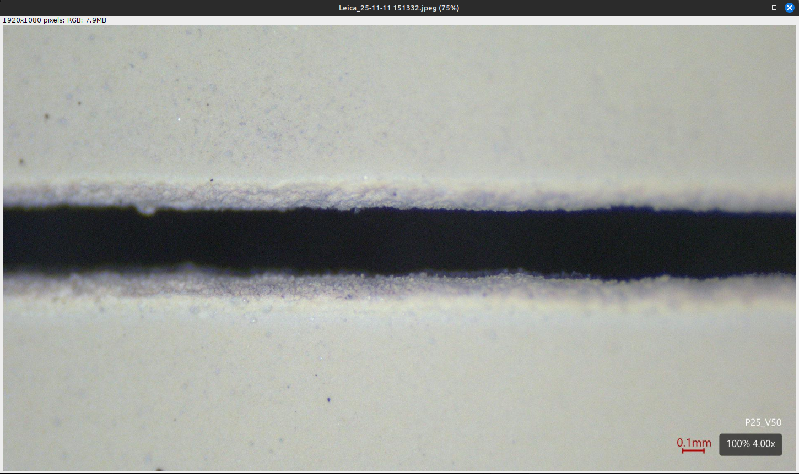
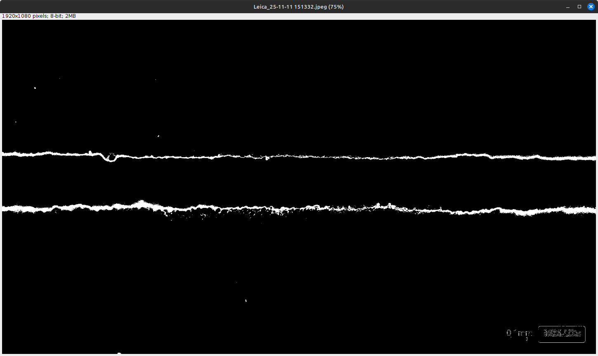
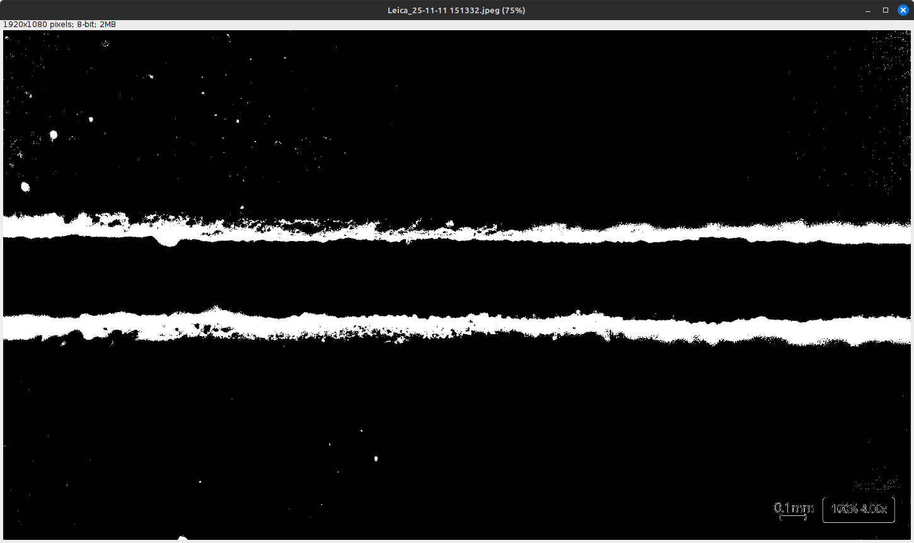
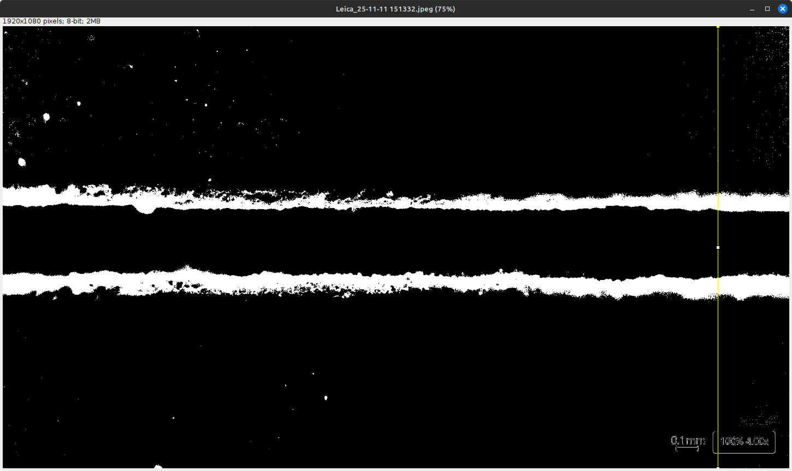

# Proceso de Medición

Para llevar a cabo las mediciones primero se necesita aplicar un procesamiento a las imágenes, esto se hace usando el software ImageJ y las macros cargadas al repositorio, *burn.ijm* y *edge.ijm* dependiendo que se quiera medir, si el ancho del corte o tamaño de la zona afectada por el calor del láser. Una vez procesada la imagen, se toman diez mediciones del perfil de intensidad de la imagen, estas mediciones están equidistantes y repartidas por toda la imagen para así tener una buena estadística. Es esta información la que se procesa luego mediante el software desarrollado en Python.

## Preparación de la Imagen

Se parte abriendo la imagen original en ImageJ:



Y luego si se quiere medir el ancho del corte se debe ejecutar la macro *edge.ijm*. Esta macro convierte la imagen a 8 bits, establece un umbral para destacar los bordes del corte y luego convierte la imagen en una máscara binaria con fondo negro. Esto hace que la imagen pase a verse así:



En caso de que se quiera medir el ancho de las zonas afectadas por el calor del láser, se debe usar la macro *burn.ijm*, la cual hace lo mismo que la anterior macro pero con valores diferentes de umbral para así destacar el ancho de las zonas quemadas en lugar del ancho del corte. La imagen resultante se ve así:



## Captura de perfiles de intesidad

Con la imagen ya lista se debe ejecutar ahora la macro *test.ijm* la cual se encarga de medir perfiles verticales de intensidad en 10 posiciones equiespaciadas a lo largo del ancho de la imagen y luego guarda todos esos datos en un archivo de texto cuya ubicación y nombre se pueden modificiar en la macro. Las mediciones se ven de esta forma:



Las mediciones almacenadas se ven de esta forma:
```
1,384,0
1,385,0
1,386,0
1,387,0
1,388,255
1,389,255
1,390,255
1,391,255
```

Donde la primer columna indica la medición realizada, en este caso es la medición 1 de 10, la segunda columna indica la posición en y, en pixeles, y por último la tercer columna representa la intensidad medidad. La escala para convertir los pixeles a centímetros se obtiene en ImageJ haciendo uso de la referencia de la imagen original.

## Procesamiento de las Mediciones

La primera parte del código de procesamiento de datos carga el archivo de las mediciones usando Pandas y obtiene los vectores de intensidad y posición en pixeles de cada una de las mediciones tomadas y las grafica para poder visualizar la información registrada.

```
archivo = "medicionP30V200.txt"
data = pd.read_csv(archivo)
xs = sorted(data["x_position"].unique())

plt.figure(figsize=(7,6))
for x in xs:
    perfil = data[data["x_position"] == x]
    y = perfil[" y"].values[300:700]
    I = perfil[" intensity"].values[300:700]
    plt.plot(I, y, label=f"x={int(x)} px")

plt.gca().invert_yaxis()
plt.ylim([300,700])
plt.xlabel("Intensidad")
plt.ylabel("y (px)")
plt.title("Perfiles de Intensidad")
plt.legend()
plt.savefig("perfil_intensidad_borde.jpg")
plt.show()
```

Luego, para medir el ancho del corte lo que la siguiente parte del código hace es tomar las 2 zonas donde la intensidad se hace mayor y tomar la distancia entre los centros de ambas zonas, ya que estas zonas son los bordes del corte. 

```
threshold = 128  # nivel para considerar "zona de corte"
gap_max = 20      # distancia máxima en píxeles para unir bloques

def unir_bloques(bloques, y, gap_max):
    if not bloques:
        return []
    bloques_unidos = [list(bloques[0])]
    for b in bloques[1:]:
        prev = bloques_unidos[-1]
        if abs(y[b[0]] - y[prev[1]]) <= gap_max:
            prev[1] = b[1]
        else:
            bloques_unidos.append(list(b))
    return [(b[0], b[1]) for b in bloques_unidos]

resultados = []

for x_val in sorted(data["x_position"].unique()):
    
    perfil = data[data["x_position"] == x_val]
    y = perfil[" y"].values[300:700]
    I = perfil[" intensity"].values[300:700]
    
    high = I > threshold
    
    bloques = []
    inicio = None
    for i in range(len(high)):
        if high[i] and inicio is None:
            inicio = i
        elif not high[i] and inicio is not None:
            bloques.append((inicio, i-1))
            inicio = None
    if inicio is not None:
        bloques.append((inicio, len(high)-1))
    
    # Unir bloques cercanos
    bloques = unir_bloques(bloques, y, gap_max)

    # Calcular centros
    centros = [(y[b[0]] + y[b[1]]) / 2 for b in bloques]
    
    if len(centros) >= 2:
        ancho = abs(centros[1] - centros[0])
    else:
        ancho = np.nan
    
    resultados.append((x_val, centros, ancho))

for r in resultados:
    print(f"x={r[0]} px → centros = {r[1]} → ancho = {r[2]} px")
```
Se muestra también para cada medición realizada donde se ubican los centros de las zonas que se detectaron como bordes del corte y el ancho en pixeles del corte. 

```
x=1 px → centros = [np.float64(436.5), np.float64(579.0)] → ancho = 142.5 px
x=2 px → centros = [np.float64(442.0), np.float64(583.0)] → ancho = 141.0 px
x=3 px → centros = [np.float64(441.0), np.float64(582.0)] → ancho = 141.0 px
x=4 px → centros = [np.float64(446.0), np.float64(581.0)] → ancho = 135.0 px
x=5 px → centros = [np.float64(444.0), np.float64(579.5)] → ancho = 135.5 px
x=6 px → centros = [np.float64(445.5), np.float64(575.5)] → ancho = 130.0 px
x=7 px → centros = [np.float64(446.0), np.float64(574.0)] → ancho = 128.0 px
x=8 px → centros = [np.float64(447.5), np.float64(585.0)] → ancho = 137.5 px
x=9 px → centros = [np.float64(451.0), np.float64(584.5)] → ancho = 133.5 px
x=10 px → centros = [np.float64(441.0), np.float64(593.0)] → ancho = 152.0 px
```

Luego se aplica la escala necesaria y se trasforma esta medición de distancia de pixeles a mm para cada medición realizada y se calcula la media del ancho del corte con su desviación estándar.

```
scale = 511.25 #px/mm
sum = 0
anchos_corte = np.zeros(len(resultados))
for i in range(len(resultados)):
    sum += resultados[i][2]
    anchos_corte[i] = resultados[i][2]/scale
mean_width = sum / len(resultados)
mean_width = mean_width / scale
print(f"Ancho promedio de corte: {mean_width:.3f} mm.")
desv = np.std(anchos_corte)
print(f"Desviación estandar de corte: {desv:.3f}.")
```
Entonces se muestra el resultado de esta medición sobre el ancho del corte realizado.
```
Ancho promedio de corte: 0.269 mm.
Desviación estandar de corte: 0.013.
```

Para la medición del ancho de las zonas quemadas, se cargan de la misma forma las mediciones realizadas, nuevamente usando Pandas y con la misma metodología que antes ya que los archivos comparten el mismo formato. La diferencia es que ahora en lugar de tener dos zonas de alta intensidad se tienen varios picos o lugar con alta intensidad, entonces para determinar cuales corresponden a la zona quemada lo que hace el algoritmo es analizar en que momento la intensidad es mayor a cierto *threshold* y a partir de ahi va "uniendo" bloques de alta intensidad hasta que la distancia entre el último bloque detectado y el siguiente sea mayor a 20px, esto indica que ya se terminó la zona quemada. Así ahora pasamos de tener varios picos de intensidad a una solo bloque que representa toda la zona quemada, por lo que es solo cuestión ahora de medir el ancho de este bloque para saber el ancho de la zona quemada.

```
threshold = 128  # nivel para considerar "zona de corte"
gap_max = 20      # distancia máxima en píxeles para unir bloques

def unir_bloques(bloques, y, gap_max):
    if not bloques:
        return []
    bloques_unidos = [list(bloques[0])]
    for b in bloques[1:]:
        prev = bloques_unidos[-1]
        if abs(y[b[0]] - y[prev[1]]) <= gap_max:
            prev[1] = b[1]
        else:
            bloques_unidos.append(list(b))
    return [(b[0], b[1]) for b in bloques_unidos]

resultados = []

for x_val in sorted(data["x_position"].unique()):
    
    perfil = data[data["x_position"] == x_val]
    y = perfil[" y"].values[300:700]
    I = perfil[" intensity"].values[300:700]
    
    high = I > threshold
    
    bloques = []
    inicio = None
    for i in range(len(high)):
        if high[i] and inicio is None:
            inicio = i
        elif not high[i] and inicio is not None:
            bloques.append((inicio, i-1))
            inicio = None
    if inicio is not None:
        bloques.append((inicio, len(high)-1))
    
    # Unir bloques cercanos
    bloques = unir_bloques(bloques, y, gap_max)

    # Calcular ancho de las zonas quemadas
    ancho_superior = bloques[0][1] - bloques[0][0]
    ancho_inferior = bloques[1][1] - bloques[1][0]
    
    resultados.append((x_val, ancho_superior, ancho_inferior))

for r in resultados:
    print(f"medición={r[0]} → franja superior = {r[1]} → franja inferior = {r[2]} px")
```

Los resultados se indican primero individualmente, mostrando el ancho en pixeles de la zona quemada inferior y superior.

```
medición=1 → franja superior = 41 → franja inferior = 54 px
medición=2 → franja superior = 36 → franja inferior = 48 px
medición=3 → franja superior = 31 → franja inferior = 49 px
medición=4 → franja superior = 27 → franja inferior = 44 px
medición=5 → franja superior = 25 → franja inferior = 46 px
medición=6 → franja superior = 37 → franja inferior = 44 px
medición=7 → franja superior = 25 → franja inferior = 47 px
medición=8 → franja superior = 32 → franja inferior = 56 px
medición=9 → franja superior = 40 → franja inferior = 54 px
medición=10 → franja superior = 0 → franja inferior = 48 px
```

Por último, se toma nuevamente la escala necesaria y se convierten las mediciones a milímetros para así calcular la media de las mediciones y la desviación estándar.

```
scale = 511.25 #px/mm
sum_sup = 0
sum_inf = 0
anchos_sup = np.zeros(len(resultados))
anchos_inf = np.zeros(len(resultados))

for i in range(len(resultados)):
    sum_sup += resultados[i][1]/scale
    sum_inf += resultados[i][2]/scale
mean_width = ((sum_sup / len(resultados))+(sum_inf / len(resultados))) / 2
print(f"Ancho promedio de la zona quemada: {mean_width:.3f} mm.")

anchos1 = []
anchos2 = []
for i in range(len(resultados)):
    anchos1.append(resultados[i][1]/scale)
for i in range(len(resultados)):
    anchos2.append(resultados[i][2]/scale)

anchos = anchos1 + anchos2
desv = np.std(anchos)
print(f"Desviación estandar de la zona quemada: {desv:.3f}.")
```

El resultado se muestra de esta forma:

```
Ancho promedio de la zona quemada: 0.077 mm.
Desviación estandar de la zona quemada: 0.025.
```
